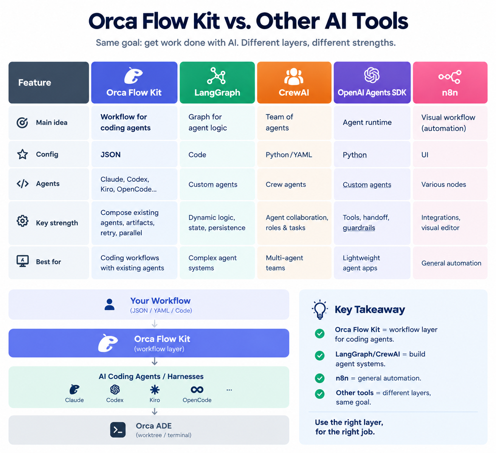
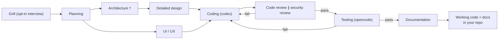
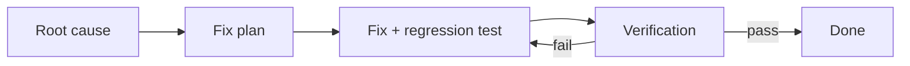
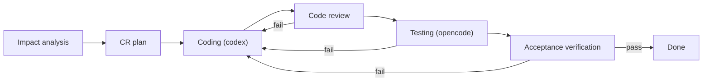

# Orca Flow Kit — Any Workflow, Not Just SDLC

<a href="https://deepwiki.com/vankhangfet/orca-sdlc-kit"></a>
<a href="https://github.com/vankhangfet/orca-sdlc-kit"></a>
<a href="LICENSE"></a>
<a href="https://github.com/vankhangfet/orca-sdlc-kit/tags"></a>
<a href="https://x.com/vankhangfet"></a>

**Build and run any AI workflow — any idea, not just SDLC. Describe the work once as a pipeline of steps (agents, models, retries, parallel groups) in one JSON config, no code ever; specialist agents do each step and write results to disk, runs are watchable live, failures loop back automatically — and every step's verdict can be pushed straight to your team's chat.**

<a href="#notifications"></a>
<a href="#notifications"></a>
<a href="#notifications"></a>
<a href="#notifications"></a>


*One command starts the whole pipeline; the status page opens in your browser and updates itself while the agents work — and every verdict can be pushed to your team's chat. [Details](#watch-it-run--the-live-status-page) · [chat notifications](#notifications) · [HD video](img/banner-animation.mp4) · [interactive version](img/banner-animation.html)*

**Three workflows ship ready to run** — full SDLC for a new build (`flow.config.json`), a bug-fix loop (`fixbug.config.json`), and a change-request flow for maintenance on an existing system (`cr.config.json`). [See them](#the-pipelines). **Deliver-the-code variants** of all three live in `.orca/workflow-template/` — same pipelines plus a final Rebase & Push step. They are ready-made examples, not the ceiling: any workflow you can describe as steps in JSON runs the same way. [Use cases](#use-cases).

**Customize everything in `.orca/flow.config.json`** — add or reorder steps, swap any step's agent, pick models per step, set retries and timeouts, run steps in parallel: plain JSON, zero code. [See how](#2-configure-your-pipeline).

## What's new

- **Workflow Designer — configure the pipeline in the browser** *(v3.0.0)* — `node .orca/designer.mjs` opens a local, token-guarded web UI: step cards in run order (drag to reorder), a full form per step (agent, model, timeouts, `parallelWith`, `onFailGoto`, spec), advisory validation, a Dry-run button that shows the plan or the exact validation error in place, a run-command bar with the exact command to copy, and a new-project tab that scaffolds a fresh workspace with its first config — `//` comments in existing files survive every save. [See it](#workflow-designer--build-pipelines-in-the-browser).
- **Per-step retry budgets** *(v2.3.1)* — a step that loops back via `onFailGoto` can declare its own `"maxRetries"` (say 20 for a loop-heavy Planning step) while every other fix loop keeps the pipeline-wide default: one long loop no longer inflates every edge's budget. Values are validated at load (negative/fractional die before any agent starts) and `--dry-run` shows a declared budget as `onFail-><id> xN`.
- **Parallel reviews** *(v2.3.0)* — code review and security review now run at the same time on the same coding output; testing waits for both, and either review failing sends the coder back, after which both reviews run again on the fix.
- **Run history & one-key resume** *(v2.2.0)* — every new run snapshots the previous run's results into `.orca/artifacts/runs/`, so nothing is ever overwritten and any two runs can be compared side by side. At startup the kit lists previous runs and lets you continue one exactly where it stopped — press `0`/Enter for a fresh run, pass `--new` to skip the question. Scripts and CI are never blocked.

Full history: [Roadmap](#roadmap) · [Releases](https://github.com/vankhangfet/orca-sdlc-kit/releases).

## Contents

- [What's new](#whats-new)
- [Why this kit](#why-this-kit)
- [Use cases](#use-cases)
- [How it compares](#how-it-compares)
- [How it works](#how-it-works)
- [Quick start](#quick-start)
  - [1. Set up your project](#1-set-up-your-project)
  - [2. Configure your pipeline](#2-configure-your-pipeline)
  - [3. Change the harness](#3-change-the-harness)
- [Cheat sheet](#cheat-sheet)
- [Workflow Designer — build pipelines in the browser](#workflow-designer--build-pipelines-in-the-browser)
- [The pipelines](#the-pipelines)
- [Watch it run — the live status page](#watch-it-run--the-live-status-page)
- [When something goes wrong](#when-something-goes-wrong)
- [Notifications](#notifications)
- [Contributing](#contributing)
- [Roadmap](#roadmap)
- [License](#license)

## Why this kit

Hand-driving AI agents doesn't survive real work: prompts shuttle between terminals, fresh chats forget old decisions, and nothing forces a review or a test to happen.

This kit turns any multi-step job into an assembly line on **[Orca ADE](https://www.onorca.dev/)** — specialist agents each do one job, write it to disk as Markdown, and hand it to the next. The shipped flows speak software, but the engine is workflow-agnostic: any sequence of steps you can describe in JSON runs the same way. Two ideas drive it:

- **Any workflow as config** — steps, agents, models, quality gates, retries, parallel groups: the whole workflow is one JSON file, no code ever. SDLC is just the first example.
- **A swappable harness** — any CLI agent Orca supports, mixed freely, changed in one JSON line.

## Use cases

If an idea fits "a few agents, each doing one job, passing its result to the next", it's a workflow this kit can run — SDLC is just the one that ships in the box. Three examples:

- **Ship a feature — full SDLC.** *"Build a login page with email + Google sign-in."* Planning → architecture → coding → parallel code + security review → testing → docs; a failed review or test sends the coder back automatically. This is the shipped default ([drawn here](#the-pipelines)).
- **Turn a rough idea into a plan.** *"Plan our migration from REST to GraphQL."* One agent researches the codebase, another drafts options with trade-offs, a reviewer challenges them — a decision-ready `PLAN.md` lands on disk. No coding step at all: the pipeline is just research → draft → review.
- **Draft, critique, polish — any content.** *"Write the v2 launch announcement."* Research → outline → draft → review loop → final text: the same retry-on-fail discipline as code, with prose artifacts instead of patches.

Each of these is just a different JSON config — the engine (retries, parallel steps, live status page, chat notifications) stays the same. [Build your own](#2-configure-your-pipeline).

## How it compares

Same goal — get work done with AI — but different tools live at different layers:



| | **This kit** | **LangGraph** | **CrewAI** | **OpenAI Agents SDK** | **n8n** |
|---|---|---|---|---|---|
| Main idea | Workflow layer for coding agents | Graph engine for agent logic | Teams of agents | Agent runtime + SDK | Visual workflow automation |
| Defined in | JSON — no code | Python | Python / YAML | Python | Visual UI |
| Agents | The CLI agents you already have — `claude`, `codex`, `cursor`, ... | You build them | You build them | You build them | Tool nodes |
| Key strength | Instant preview, live status page, results on disk | Dynamic logic, full graph control | Role-based collaboration | SDK integrations | Tools, hooks, data apps |
| Best for | Multi-step work done end to end by your coding agents | Complex custom agent graphs | Multi-agent teamwork | Lightweight OpenAI projects | General automation |

**Different layers, not competitors.** LangGraph, CrewAI and the OpenAI Agents SDK are the *agent brain* — you code your own agents and their logic. n8n wires tools and data together. This kit is the *workflow layer above real agents*: it takes the coding-agent CLIs you already use and runs them as a disciplined pipeline — retries, gates, parallel steps, observability — from one JSON file. Use the right layer for the right job.

## How it works

```bash
node .orca/flow.mjs "Build a login page with email + Google sign-in"
```

Specialist agents take over — in the shipped flow that's planner, architect, coder, reviewers, tester, writer — each doing one job and handing its Markdown result to the next. Your workflow, your specialists. [The shipped pipelines, drawn](#the-pipelines).

The two design steps and the two review steps each run **concurrently** — one `parallelWith` line per pair in the config; any independent pair of steps can. Coding and testing each wait for both members of their pair.

What makes this safe rather than a black box:

- **Everything is left on disk.** Each step writes a Markdown artifact (`PLAN.md`, `ARCHITECTURE.md`, `CHANGES.md`, ...) into `.orca/artifacts/` — check, edit or reuse any intermediate result. Every new run also snapshots the previous run's artifacts into `.orca/artifacts/runs/<seq>-<timestamp>/`, so runs can be compared side by side.
- **Quality failures loop back.** Review, security or test failures send the coder back automatically, up to bounded retries.
- **Nudge (auto-retry)** — a worker that finished (or stalled) without writing its artifact gets its terminal nudged to write it, before any expensive re-dispatch. Ships disabled; enable by setting `nudgeRetries` > 0 (`nudgeTimeoutMs` tunes the wait). Parked dialogs are never touched.
- **Every run is accounted for.** Per-step tokens (in / out / cache) go to `USAGE.md` in the artifacts dir and onto the status page. (Numbers for opencode, gemini, cursor, grok and kiro-cli steps are not available yet.)
- **Results can reach your team.** Fill in `.orca/notify.json` and every step's verdict — plus the final run summary with a safe resume command — lands in Slack, Telegram, MS Teams or WhatsApp while the run is going (default off). [How](#notifications).

## Quick start

### 1. Set up your project

**Prerequisites.** The kit has no runtime of its own — it drives agents inside **[Orca ADE](https://www.onorca.dev/)** terminals and worktrees:

- **Orca ADE**, installed and signed in — no Orca, no run.
- **Node.js** (any recent version) — one script, zero npm dependencies.
- **The agent CLIs you'll use** (`claude`, `codex`, `opencode`, ...) — installed and logged in.

**Install — either way works:**

**Option A — one command:**

```bash
npx github:vankhangfet/orca-sdlc-kit
```

Copies the kit (`.orca/flow.mjs`, all three configs, the reference docs, `orca.yaml`) into the project and gitignores `.orca/artifacts/`. Re-runs only add missing files — your edits are safe; `--force` resets everything to the shipped versions.

**Option B — manual copy:** copy `orca.yaml` and the `.orca/` folder into the project root; gitignore `.orca/artifacts/`.

**Then, either way:**

1. Orca: Settings -> Experimental -> enable **Orchestration** (`orca status --json` to verify).
2. Create a worktree in Orca — the hook prepares `.orca/artifacts` for you.
3. Preview, then run:

```bash
node .orca/flow.mjs --dry-run "Build a login page"   # the plan, calls nothing
node .orca/flow.mjs "Build a login page"             # the real run
```

Optional Orca button (Settings -> Quick Commands, scope **Project**): `Run SDLC flow` -> `node .orca/flow.mjs "Objective"`.

### 2. Configure your pipeline

Everything lives in `.orca/flow.config.json` — no code edits, ever. The kit is stack-agnostic; name a tool in a step's `spec` (e.g. "run tests with pytest") to force it.

| I want to... | Do this |
|---|---|
| Skip a step (e.g. no UI/UX) | set `"enabled": false` on that step — later steps adjust automatically |
| Change what a step does | edit its `"spec"` text; `{out}` / `{reads}` / `{tasks}` are filled in for you |
| Add my own step (e.g. a lint gate) | add an entry to the `"pipeline"` array — array order is run order |
| Retry harder on failures | raise `"maxRetries"` (how often review/test failures loop back to coding); or give ONE loop-heavy step its own budget with `"maxRetries"` on that step (e.g. planning loops 20x while review/test keep the global 2) |
| Give a step more time | raise its `"timeoutMs"` (max silence) / `"hardTimeoutMs"` (absolute cap) |
| Run two steps at the same time | set `"parallelWith": "<earlier-step-id>"` on the later step — both start together; the next step waits for both |
| Run just part of the pipeline | `--only planning,architecture "..."` |
| Continue after a crash or a long step | re-run with `--from coding` — earlier artifacts are reused |

Two knobs cover the rest:

- **`autoRun` (default `true`) — how much it asks you.** `true`: walk away — agents never ask, they decide and record assumptions in the artifact for later audit; gates are ignored and Claude agents run with permission bypass (full tool access, one-time per-machine acceptance). `false`: agents may ask in their terminal; `"gate": true` steps pause for your approval; `"interactive": true` steps (the shipped Architecture step) interview you, one question at a time.
- **Worktree (default: auto-detected) — where it runs.** Pin only when launching from outside the target: `--worktree name:lab2` for one run, `ORCA_FLOW_WORKTREE` for your machine. A wrong pin fails immediately with the list of valid worktrees — never mid-run.

Prefer clicking over JSON? The [Workflow Designer](#workflow-designer--build-pipelines-in-the-browser) edits these files visually.

### 3. Change the harness

Any step, any agent — one field:

```json
{
  "id": "coding",
  "title": "Coding",
  "agent": "codex",
  "spec": "..."
}
```

- **Supported:** any CLI agent Orca supports — the tested set is `claude`, `codex`, `opencode`, `gemini`, `cursor`, `grok`, `kiro-cli`; anything else from Orca's catalog (GitHub Copilot, Amp, Cline, Droid, Kimi, Qwen Code, ...) runs the same way — put its command in `"agent"`. The shipped config already mixes them (coding on codex, testing on opencode, rest on claude).
- **Model per step:** optional `"model"` on a step, or `"model"` under `defaults` for all. `"default"` (or missing) keeps the agent's own model — nothing is passed; anything else is passed as `--model <value>`. A model flag inside the `agent` string wins.
- **One run only:** `node .orca/flow.mjs --agent coding=claude "Objective"` — the config stays untouched. Multi-word values like `"kiro-cli --trust-all-tools"` pass through as-is.

Full field reference (timeouts, models, custom steps, the fix loop): [`.orca/CONFIGURATION.md`](.orca/CONFIGURATION.md).

## Cheat sheet

```bash
node .orca/flow.mjs "Objective"                     # the whole pipeline
node .orca/flow.mjs --dry-run "Objective"           # preview only — always try this first
node .orca/flow.mjs --status-preview                # sample dashboard only — never with an objective
node .orca/flow.mjs --from coding "Objective"       # resume / skip the design phase
node .orca/flow.mjs --only planning,architecture "Objective"
node .orca/flow.mjs --grill-me "Objective"          # interview me before planning
node .orca/flow.mjs --agent coding=claude "Objective"   # one-off agent swap for a step
node .orca/flow.mjs --config fixbug.config.json "Bug report"
node .orca/flow.mjs --config cr.config.json "Change request"
node .orca/flow.mjs --worktree name:lab "Objective" # only when launching from outside the target
```

Manual mode (gates + interviews): set `"autoRun": false` in the config, then run normally.

**Resuming runs.** At startup the flow lists the worktree's previous runs and offers to resume one — picking a run restores its artifacts and continues at its first unfinished step; `0`/Enter starts fresh. Pass `--new` to skip the prompt.

## Workflow Designer — build pipelines in the browser

Hand-editing JSON is the power-user path. For everyone else (and for spinning up
a brand-new project), the kit ships a small local UI:

```bash
node .orca/designer.mjs          # opens http://127.0.0.1:7887/?t=<one-time token>
```

![The Workflow Designer in the browser: the Pipeline tab lists every step as a
numbered card in run order — agent chips (claude, codex), reads arrows,
‖ parallel markers, ↺ loop-back badges — and the form on the right edits the
selected step: id, title, agent, model, writes, timeouts, onFailGoto,
parallelWith, enabled/gate/interactive flags, the spec prompt with {out} /
{reads} placeholders, and reads checkboxes; the header carries the objective
field, Save / Dry-run buttons and the exact node .orca/flow.mjs run command
for the workflow being edited](img/Flow-design.png)

*The whole pipeline configurable through the web UI — the Planning step selected, its agent, artifact, reads and prompt open in the form on the right; the header previews the exact run command for the workflow being edited.*

- **Visual pipeline editor** — step cards in run order (drag to reorder),
  a full form per step (agent, `reads`, `writes`, `spec`, timeouts, `parallelWith`,
  `onFailGoto`…), advisory validation badges, and a config-defaults tab.
- **Creates AND edits** — every `*.config.json` in `.orca/` and
  `.orca/workflow-template/`; `//` comment keys in existing files survive edits.
- **Dry-run button** — runs `flow.mjs --dry-run` against the file on disk and
  shows the plan (or the exact validation error) in place.
- **Run command bar** — shows the exact `node .orca/flow.mjs ...` command for
  the workflow you're editing; click to copy. Real runs stay in your terminal.
- **New project tab** — scaffold a fresh workspace: copies the kit into any
  folder, drops in your first workflow config, prints the commands to run.
- **Guided + fast** — a dismissible 3-step guide (Pipeline → Configure
  defaults → New project) orients first-time users; keyboard shortcuts
  `S` save · `R` dry-run · `D` density · `?` legend; a Comfortable/Compact
  density toggle auto-tightens for 8+ step pipelines.

Notes: binds `127.0.0.1` only, guarded by a per-launch token; zero dependencies;
`flow.mjs` itself never serves anything. Flags: `--port <n>`, `--no-open`.

## The pipelines

**Full SDLC (`flow.config.json`) — the default:**



Claude runs the steps not labeled otherwise. Failures loop back to coding (max 2 retries). Every step writes a Markdown artifact (`PLAN.md`, `CHANGES.md`, ...) to `.orca/artifacts/`, plus the flow's own `USAGE.md` token report (reserved name).

† In manual mode this step interviews you first (see `autoRun`).

**Bug fix (`fixbug.config.json`):**



```bash
node .orca/flow.mjs --config fixbug.config.json "<what happens, expected behavior, how to reproduce>"
```

**Change request (`cr.config.json`):**



```bash
node .orca/flow.mjs --config cr.config.json "<what changes and why, on the existing system>"
```

**Workflow templates (`.orca/workflow-template/`):** the same three, each ending with **Rebase & Push** — commit pending work, rebase onto `origin/main`, resolve conflicts, push. Suggestions, not a fixed menu: any pipeline you can describe in JSON runs the same way.

```bash
node .orca/flow.mjs --config workflow-template/<sdlc|fixbug|cr>.config.json "<objective>"
```

## Watch it run — the live status page

That dashboard at the top is `<worktree>/.orca/artifacts/status.html` — it opens itself in your browser when a run starts and updates on its own: which step is running, what's done, what's next, timings, retries, artifacts. No refresh button, no server.


*The full dashboard, mid-run — including the Tasks checklist and a failed step looping back.*

The **Tasks card** is the star: steps with a checklist (`progress` in config — the coding step has one) show every task as `○` queued, `◐` in progress or `✓` done (`.orca/artifacts/TASKS.md`), ticked off live by the coding agent.

After a run ends the page shows token usage: totals per step in the rail, the run total in the header, per-step in / out / cache breakdown on the summary card — `USAGE.md` is the detailed record.

A `--from` resume continues the same picture, earlier steps keeping their original durations. If the page can't be written the run continues untouched. Peek without a run: `--status-preview` (never with an objective or `--only`/`--from`/`--agent`). Disable auto-open: `--no-open-status` or `"defaults": { "openStatus": false }`.

## When something goes wrong

- **Preview first** — `--dry-run` shows exactly what will run.
- **Silence is not failure** — long quiet steps are waited on until they settle or hit their cap; only a definite FAIL verdict loops back.
- **An agent is PARKED on a prompt** — answer it in that terminal; the run continues on its own.
- **A step ran out of time** — the terminal stays open; re-run with the printed `--from <step>` command.
- **`artifact missing after N nudge(s)`** — the worker acknowledged completion but never wrote the file, and N nudges to its terminal went unanswered. Inspect the step's terminal output, fix the cause (context too small, wrong output path in the agent's reply), and resume with `--from <step>`.
- **Picked the wrong run at startup** — re-run and choose 0 for a fresh start (the previous state was archived — nothing is lost), or pass --new to skip the prompt.

Details and fixes (claude dialogs, EBADF crash, stale Orca state, version drift): [TROUBLESHOOTING.md](TROUBLESHOOTING.md).

## Notifications

The pipeline can report itself to chat: **every step settlement** (succeeded / failed / still-running — retries notify per attempt) and **one run-end summary** (verdict, duration, and on failure the exact safe `--from` resume command) are POSTed while the run is going.

Fill in [`.orca/notify.json`](.orca/notify.json) — shipped empty, meaning **off** until you do — and pick your platform:

| Platform | `provider` | What goes in the file |
|---|---|---|
| Slack | `slack` | `url` = incoming webhook |
| Telegram | `telegram` | `url` = `https://api.telegram.org/bot<TOKEN>/sendMessage`, plus `chatId` |
| MS Teams | `teams` | `url` = Workflows incoming webhook (rendered as an Adaptive Card) |
| WhatsApp | `whatsapp` | `url` = Graph API `.../<PHONE_NUMBER_ID>/messages`, plus `token` + `to` |
| Anything else | `generic` | `url` = any JSON endpoint; receives the full structured payload |

```jsonc
{ "enabled": true, "provider": "slack", "url": "https://hooks.slack.com/services/...",
  "token": "", "chatId": "", "to": "", "events": ["step", "run"] }
```

- **Never affects the run.** Delivery is timeout-guarded (9s abort / 12s hard cap per message, in a child process); a dead webhook warns once — with a secrets-free reason like `HTTP 401` — and is disabled for the rest of the run.
- **Tune it.** `"events"` picks what you get (`["step","run"]` = both, `[]` = off, `["run"]` = once per run for slow endpoints). `--dry-run` prints the resolved state (`Notifications: on (slack, events: step,run)`) and sends nothing; `ORCA_FLOW_NOTIFY_FILE` points the run at a different config file.
- **Secrets stay secret.** The webhook URL and tokens travel via stdin — never in argv or logs. After filling the file in, add `notify.json` to your `.gitignore`.

Full field reference: [`.orca/CONFIGURATION.md`](.orca/CONFIGURATION.md) §9 · Troubleshooting: [TROUBLESHOOTING.md](TROUBLESHOOTING.md#notifications)

## Contributing

Issues and PRs are welcome at [github.com/vankhangfet/orca-sdlc-kit](https://github.com/vankhangfet/orca-sdlc-kit). Ground rules:

- **Pipeline behavior belongs in the configs** — a new field in `flow.config.json` / `fixbug.config.json` plus a paragraph in [`.orca/CONFIGURATION.md`](.orca/CONFIGURATION.md), not new logic in `flow.mjs`.
- **Docs ship with the change** — README, TROUBLESHOOTING.md and CONFIGURATION.md in the same PR as any behavior change.
- **Conventional commits** (`feat:`, `fix:`, `docs:`, ...). Never commit `docs/` (internal notes) or `.orca/artifacts/` (runtime output) — both are gitignored.
- **Run the suite before you push** — `npm test` replays the real `flow.mjs` against a fake Orca CLI (offline: no agents, no real Runs, ~2-4 min). It pins the engine's liveness semantics, hard caps, the `onFailGoto` fix loop, resume and parallel settlement — exactly the regressions a casual edit can silently reintroduce. Iterate on one scenario with `node test/run-tests.mjs --only E4`; if your PR changes engine behavior, add or tighten a scenario in `test/` in the same commit.
- **Fast checks** — no build toolchain; the quick loop is:

```bash
node --check .orca/flow.mjs                                                        # syntax
node -e "JSON.parse(require('fs').readFileSync('.orca/flow.config.json','utf8'))"   # config validity
node .orca/flow.mjs --dry-run --worktree name:lab2 "objective"                     # plan preview (this repo is not a worktree)
```

Looking for something to pick up? [ROADMAP.md](ROADMAP.md) lists what's planned — and what will *not* be built.

## Roadmap

Next in the v2 line (v2.0.x): the rest of config validation, an artifact viewer, run history on the status page, and auto-resume; later minors add agent fallback and batch runs — see [ROADMAP.md](ROADMAP.md).

## License

[MIT](LICENSE)
