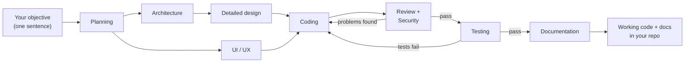

# Orca SDLC Flow Kit

<a href="https://deepwiki.com/vankhangfet/orca-sdlc-kit"></a>
<a href="https://github.com/vankhangfet/orca-sdlc-kit"></a>
<a href="LICENSE"></a>
<a href="https://github.com/vankhangfet/orca-sdlc-kit/tags"></a>
<a href="https://x.com/vankhangfet"></a>

**A pipeline of AI agents that plans, codes, reviews, tests and documents — the whole pipeline (steps, agents, models, retries, parallel groups) defined in one JSON config, no code ever; results land on disk, runs are watchable live, quality failures loop back automatically.**


*The live status page — opens in your browser when a run starts and updates itself while the agents work. [Details](#watch-it-run--the-live-status-page).*

**Three flows ship ready to run** — full SDLC for a new build (`flow.config.json`), a bug-fix loop (`fixbug.config.json`), and a change-request flow for maintenance on an existing system (`cr.config.json`). [See them](#the-pipelines).

**Customize everything in `.orca/flow.config.json`** — add or reorder steps, swap any step's agent, pick models per step, set retries and timeouts, run steps in parallel: plain JSON, zero code. [See how](#2-configure-your-pipeline).

## Contents

- [Why this kit](#why-this-kit)
- [How it works](#how-it-works)
- [Quick start](#quick-start)
  - [1. Set up your project](#1-set-up-your-project)
  - [2. Configure your pipeline](#2-configure-your-pipeline)
  - [3. Change the harness](#3-change-the-harness)
- [Cheat sheet](#cheat-sheet)
- [The pipelines](#the-pipelines)
- [Watch it run — the live status page](#watch-it-run--the-live-status-page)
- [When something goes wrong](#when-something-goes-wrong)
- [Contributing](#contributing)
- [Roadmap](#roadmap)
- [License](#license)

## Why this kit

Driving AI agents by hand does not survive a real feature: you shuttle prompts between terminals, every fresh chat forgets what the last one decided, nothing forces a review or a test to happen, and one bad answer in a single do-everything session poisons everything downstream.

This kit turns that into an assembly line. On the runtime provided by **[Orca ADE](https://www.onorca.dev/)** — disposable worktrees, agent terminals, run tracking — a small team of specialists (planner, architect, coder, reviewers, tester, writer) each does one job, writes its result to disk as Markdown, and hands it to the next. Cross-platform, one folder, needs only Node.

Two ideas drive it:

- **It works like a real SDLC.** Specialists with quality gates between them — the pipeline defends its quality, it doesn't just generate code.
- **The harness is yours to swap.** Each step runs on any supported agent — claude, codex, opencode, gemini, cursor, grok, kiro-cli — mixed freely, changed in one JSON line. No code edits, ever.

## How it works

```bash
node .orca/flow.mjs "Build a login page with email + Google sign-in"
```

Specialist agents take over:



The two design steps run **concurrently** — one `parallelWith` line in the config; any independent pair of steps can. Coding waits for both.

What makes this safe rather than a black box:

- **Everything is left on disk.** Each step writes a Markdown artifact (`PLAN.md`, `ARCHITECTURE.md`, `CHANGES.md`, ...) into `.orca/artifacts/` — check, edit or reuse any intermediate result.
- **Quality failures loop back.** Review, security or test failures send the coder back automatically, up to bounded retries.
- **Every run is accounted for.** Per-step tokens (in / out / cache) go to `USAGE.md` in the artifacts dir and onto the status page. (Numbers for opencode, gemini, cursor, grok and kiro-cli steps are not available yet.)

## Quick start

### 1. Set up your project

**Prerequisites.** The kit has no runtime of its own — it drives agents inside **[Orca ADE](https://www.onorca.dev/)** terminals and worktrees:

- **Orca ADE**, installed and signed in — no Orca, no run.
- **Node.js** (any recent version) — one script, zero npm dependencies.
- **The agent CLIs you'll use** (`claude`, `codex`, `opencode`, ...) — installed and logged in.

**Install — either way works:**

**Option A — one command:**

```bash
npx github:vankhangfet/orca-sdlc-kit
```

Copies the kit (`.orca/flow.mjs`, all three configs, the reference docs, `orca.yaml`) into the project and gitignores `.orca/artifacts/`. Re-runs only add missing files — your edits are safe; `--force` resets everything to the shipped versions.

**Option B — manual copy:** copy `orca.yaml` and the `.orca/` folder into the project root; gitignore `.orca/artifacts/`.

**Then, either way:**

1. Orca: Settings -> Experimental -> enable **Orchestration** (`orca status --json` to verify).
2. Create a worktree in Orca — the hook prepares `.orca/artifacts` for you.
3. Preview, then run:

```bash
node .orca/flow.mjs --dry-run "Build a login page"   # the plan, calls nothing
node .orca/flow.mjs "Build a login page"             # the real run
```

Optional Orca button (Settings -> Quick Commands, scope **Project**): `Run SDLC flow` -> `node .orca/flow.mjs "Objective"`.

### 2. Configure your pipeline

Everything lives in `.orca/flow.config.json` — no code edits, ever. The kit is stack-agnostic; name a tool in a step's `spec` (e.g. "run tests with pytest") to force it.

| I want to... | Do this |
|---|---|
| Skip a step (e.g. no UI/UX) | set `"enabled": false` on that step — later steps adjust automatically |
| Change what a step does | edit its `"spec"` text; `{out}` / `{reads}` / `{tasks}` are filled in for you |
| Add my own step (e.g. a lint gate) | add an entry to the `"pipeline"` array — array order is run order |
| Retry harder on failures | raise `"maxRetries"` (how often review/test failures loop back to coding) |
| Give a step more time | raise its `"timeoutMs"` (max silence) / `"hardTimeoutMs"` (absolute cap) |
| Run two steps at the same time | set `"parallelWith": "<earlier-step-id>"` on the later step — both start together; the next step waits for both |
| Run just part of the pipeline | `--only planning,architecture "..."` |
| Continue after a crash or a long step | re-run with `--from coding` — earlier artifacts are reused |

Two knobs cover the rest:

- **`autoRun` (default `true`) — how much it asks you.** `true`: walk away — agents never ask, they decide and record assumptions in the artifact for later audit; gates are ignored and Claude agents run with permission bypass (full tool access, one-time per-machine acceptance). `false`: agents may ask in their terminal; `"gate": true` steps pause for your approval; `"interactive": true` steps (the shipped Architecture step) interview you, one question at a time.
- **Worktree (default: auto-detected) — where it runs.** Pin only when launching from outside the target: `--worktree name:lab2` for one run, `ORCA_FLOW_WORKTREE` for your machine. A wrong pin fails immediately with the list of valid worktrees — never mid-run.

### 3. Change the harness

Any step, any agent — one field:

```json
{
  "id": "coding",
  "title": "Coding",
  "agent": "codex",
  "spec": "..."
}
```

- **Supported:** `claude`, `codex`, `opencode`, `gemini`, `cursor`, `grok`, `kiro-cli` — the shipped config already mixes them (coding on codex, testing on opencode, rest on claude).
- **Model per step:** optional `"model"` on a step, or `"model"` under `defaults` for all. `"default"` (or missing) keeps the agent's own model — nothing is passed; anything else is passed as `--model <value>`. A model flag inside the `agent` string wins.
- **One run only:** `node .orca/flow.mjs --agent coding=claude "Objective"` — the config stays untouched. Multi-word values like `"kiro-cli --trust-all-tools"` pass through as-is.

Full field reference (timeouts, models, custom steps, the fix loop): [`.orca/CONFIGURATION.md`](.orca/CONFIGURATION.md).

## Cheat sheet

```bash
node .orca/flow.mjs "Objective"                     # the whole pipeline
node .orca/flow.mjs --dry-run "Objective"           # preview only — always try this first
node .orca/flow.mjs --status-preview                # sample dashboard only — never with an objective
node .orca/flow.mjs --from coding "Objective"       # resume / skip the design phase
node .orca/flow.mjs --only planning,architecture "Objective"
node .orca/flow.mjs --grill-me "Objective"          # interview me before planning
node .orca/flow.mjs --agent coding=claude "Objective"   # one-off agent swap for a step
node .orca/flow.mjs --config fixbug.config.json "Bug report"
node .orca/flow.mjs --config cr.config.json "Change request"
node .orca/flow.mjs --worktree name:lab "Objective" # only when launching from outside the target
```

Manual mode (gates + interviews): set `"autoRun": false` in the config, then run normally.

## The pipelines

**Full SDLC (`flow.config.json`) — the default:**

| # | Step | Agent | Writes | On fail |
|---|------|-------|--------|---------|
| 0* | Grill Me (requirements interview, opt-in) | claude | BRAINSTORM.md | — |
| 1 | Planning | claude | PLAN.md | — |
| 2 | Architecture Design † | claude | ARCHITECTURE.md | — |
| 3 | Detailed Design | claude | DETAILED_DESIGN.md | — |
| 4 | UI/UX Design | claude | UIUX_MOCKS.md | — |
| 5 | Coding | codex | CHANGES.md | — |
| 6 | Code Review | claude | REVIEW.md | back to 5 |
| 7 | Security Review | claude | SECURITY_REVIEW.md | back to 5 |
| 8 | Testing | opencode | TEST_REPORT.md | back to 5 |
| 9 | Documentation | claude | DOCUMENTATION.md | — |

\* Disabled by default; enable per run with `--grill-me` or permanently in config.
† In manual mode this step interviews you first (see `autoRun` above).

The flow adds one file of its own to the same dir: `USAGE.md`, the cumulative per-run token report, appended when each run ends (reserved name — don't use it as a step's `writes`). Steps 3 and 4 run **concurrently** (`parallelWith`); Coding waits for both.

**Bug fix (`fixbug.config.json`):** Root Cause Analysis -> Fix Plan -> Bug Fix incl. regression test -> Fix Verification, looping back on failure (max 2 retries).

```bash
node .orca/flow.mjs --config fixbug.config.json "<what happens, expected behavior, how to reproduce>"
```

**Change request (`cr.config.json`):** for maintenance on an existing system — Impact Analysis on the current code -> CR Plan with acceptance criteria -> Coding -> Code Review -> Testing incl. regression -> Acceptance Verification, looping back on failure (max 2 retries).

```bash
node .orca/flow.mjs --config cr.config.json "<what changes and why, on the existing system>"
```

## Watch it run — the live status page

That dashboard at the top is `<worktree>/.orca/artifacts/status.html` — it opens itself in your browser when a run starts and updates on its own: which step is running, what's done, what's next, timings, retries, artifacts. No refresh button, no server.

The **Tasks card** is the star: steps with a checklist (`progress` in config — the coding step has one) show every task as `○` queued, `◐` in progress or `✓` done (`.orca/artifacts/TASKS.md`), ticked off live by the coding agent.

After a run ends the page shows token usage: totals per step in the rail, the run total in the header, per-step in / out / cache breakdown on the summary card — `USAGE.md` is the detailed record.

A `--from` resume continues the same picture, earlier steps keeping their original durations. If the page can't be written the run continues untouched. Peek without a run: `--status-preview` (never with an objective or `--only`/`--from`/`--agent`). Disable auto-open: `--no-open-status` or `"defaults": { "openStatus": false }`.

## When something goes wrong

- **Preview first** — `--dry-run` shows exactly what will run.
- **One-time "accept responsibility" dialog (claude)** — asked once per machine on the first bypass session; accept it once, or pre-set `"skipDangerousModePermissionPrompt": true` in user-level Claude Code settings. Bypass = full tool access, which is why unattended pipelines belong in disposable Orca worktrees (the default here).
- **A step looks quiet for a long time** — silence is not failure: a worker deep in one long verification (reviews routinely run an hour) is waited on until it settles or its hard cap hits; the fix loop triggers only on a definite FAIL verdict, never on silence.
- **An agent is PARKED on a prompt** — `bypassPermissions` does not bypass your machine's `permissions.ask` rules, and Claude Code's folder-trust check on a fresh worktree also waits for a human (default is *exit*). The flow reads the agent's screen: a known dialog (permission confirmation, folder-trust, CLI update) on a frozen screen is logged once and noted on the status page — answer it in that terminal and the run continues on its own. The flow never answers prompts for you; accept folder-trust once per repo.
- **A step is taking forever** — shown as STILL RUNNING; the terminal is left open and the flow prints the exact `--from <step>` command to continue later.
- **Stale orchestration state after experiments** — `orca orchestration reset --all --json`.
- **CLI flags differ on your Orca version** — check `orca skills get orchestration --full`.
- **Claude crashes with `EBADF ... history.jsonl.lock` (Windows)** — known Claude Code bug ([#15739](https://github.com/anthropics/claude-code/issues/15739)); the flow already spawns Claude agents in a way that avoids it. If it recurs: close other Claude sessions during interactive steps, or update Claude Code.

## Contributing

Issues and PRs are welcome at [github.com/vankhangfet/orca-sdlc-kit](https://github.com/vankhangfet/orca-sdlc-kit). Ground rules:

- **Pipeline behavior belongs in the configs** — a new field in `flow.config.json` / `fixbug.config.json` plus a paragraph in [`.orca/CONFIGURATION.md`](.orca/CONFIGURATION.md), not new logic in `flow.mjs`.
- **Docs ship with the change** — README and CONFIGURATION.md in the same PR as any behavior change.
- **Conventional commits** (`feat:`, `fix:`, `docs:`, ...). Never commit `docs/` (internal notes) or `.orca/artifacts/` (runtime output) — both are gitignored.
- **Verify before you push** — no build or test toolchain; the loop is:

```bash
node --check .orca/flow.mjs                                                        # syntax
node -e "JSON.parse(require('fs').readFileSync('.orca/flow.config.json','utf8'))"   # config validity
node .orca/flow.mjs --dry-run --worktree name:lab2 "objective"                     # plan preview (this repo is not a worktree)
```

Looking for something to pick up? [ROADMAP.md](ROADMAP.md) lists what's planned — and what will *not* be built.

## Roadmap

Next in the v2.0 line: config validation before any agent starts, an artifact viewer, run history on the status page, and auto-resume; v2.0.x minors add notifications, agent fallback and batch runs — see [ROADMAP.md](ROADMAP.md).

## License

[MIT](LICENSE)
