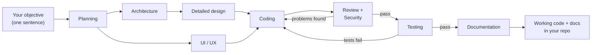

# Orca SDLC Flow Kit

**Describe a feature in one sentence. Get back a planned, designed, coded, reviewed, tested and documented implementation.**

A small "software team" of AI agents inside Orca ADE — planner, architect, coder, reviewers, tester, writer. You give the objective; they run the relay. Every step is switched on/off, re-ordered or reassigned in one config file. Cross-platform (Windows / macOS / Linux), needs only Node.

## How it works

```bash
node .orca/flow.mjs "Build a login page with email + Google sign-in"
```

Specialist agents take over, each doing one job and handing its work to the next:



Two things make this safe rather than a black box:

- **Everything is left on disk.** Each step writes a readable Markdown artifact (`PLAN.md`, `ARCHITECTURE.md`, `CHANGES.md`, ...) into `.orca/artifacts/` — check, edit or reuse any intermediate result.
- **Quality failures loop back.** If review, security review or tests find problems, the coder is sent back to fix them — automatically, up to a bounded number of retries.

## Set up your project

1. Copy `orca.yaml` and the `.orca/` folder into your project root.
2. Add `.orca/artifacts/` to your `.gitignore`.
3. In Orca: Settings -> Experimental -> enable **Orchestration** (verify with `orca status --json`).
4. Create a worktree in Orca — the hook prepares `.orca/artifacts` for you.
5. Preview, then run:

```bash
node .orca/flow.mjs --dry-run "Build a login page"   # shows the plan, calls nothing
node .orca/flow.mjs "Build a login page"             # the real run
```

Optional Orca button — Settings -> Quick Commands (scope **Project**): `Run SDLC flow` -> `node .orca/flow.mjs "Objective"`.

## Configure it for your project

Everything lives in `.orca/flow.config.json` — no code edits, ever. The kit is stack-agnostic; to force a specific tool, name it in a step's `spec` (e.g. "run tests with pytest").

| I want to... | Do this |
|---|---|
| Skip a step (e.g. no UI/UX) | set `"enabled": false` on that step — later steps adjust automatically |
| Use a different AI for a step | edit `"agent"` — claude, codex, opencode, gemini, cursor, grok, kiro-cli |
| Change what a step does | edit its `"spec"` text; `{out}` / `{reads}` are filled in for you |
| Add my own step (e.g. a lint gate) | add an entry to the `"pipeline"` array — order in the array is the run order |
| Retry harder on failures | raise `"maxRetries"` (how often review/test failures loop back to coding) |
| Give a step more time | raise its `"timeoutMs"` (max silence) / `"hardTimeoutMs"` (absolute cap) |
| Run just part of the pipeline | `--only planning,architecture "..."` |
| Continue after a crash or a long step | re-run with `--from coding` — earlier artifacts are reused |

Two knobs cover the rest:

- **`autoRun` (default `true`) — how much it asks you.** `true`: start it and walk away — agents never ask, they decide and record assumptions in the artifact for you to audit later; gates are ignored. `false` (manual mode): agents may ask in their terminal; steps with `"gate": true` pause for your approval, and steps with `"interactive": true` (the shipped Architecture step) interview you — one question at a time, confirming every decision before writing.
- **The worktree (default: auto-detected) — where it runs.** Agents run in the Orca worktree of the folder you launch from. Pin only when launching from outside the target: `--worktree name:lab2` for one run, `ORCA_FLOW_WORKTREE` for your machine. A wrong pin fails immediately with the list of valid worktrees — never mid-run.

Full field reference (timeouts, models, custom steps, the fix loop): [`.orca/CONFIGURATION.md`](.orca/CONFIGURATION.md).

## Watch it run — the live status page

While the pipeline runs, the flow writes a live dashboard into the worktree: open
`<worktree>/.orca/artifacts/status.html` in a browser (it opens by itself when
the run starts) and it updates on its own — which step is running,
what is done, what comes next, timings, retry attempts, and the final artifact
list.

Steps that carry a task checklist (`progress` in config — the coding step does)
also get a live **Tasks card**: the coding agent first breaks the plan into a
checkbox list (`.orca/artifacts/TASKS.md`), then ticks each task off as it
works — `○` queued, `◐` in progress, `✓` done — so mid-coding you always know
what is done, what is in flight and what is left.

An interrupted run resumed with `--from` continues the same picture, with
earlier steps keeping their original durations. If the page can't be written
(e.g. a read-only folder) the run continues untouched — the dashboard never
affects the pipeline. Disable the auto-open with `--no-open-status` or
`"defaults": { "openStatus": false }`.

Want a peek without starting a run? `node .orca/flow.mjs --status-preview`
writes a sample dashboard showing every state to `.orca/status-preview/`.
It is a fixture only — never combine it with an objective or
`--only`/`--from`/`--agent` (the flow refuses the mix). Real runs need no
flag: the page opens by itself.

## The pipelines

**Full SDLC (`flow.config.json`) — the default:**

| # | Step | Agent | Writes | On fail |
|---|------|-------|--------|---------|
| 0* | Grill Me (requirements interview, opt-in) | claude | BRAINSTORM.md | — |
| 1 | Planning | claude | PLAN.md | — |
| 2 | Architecture Design † | claude | ARCHITECTURE.md | — |
| 3 | Detailed Design | claude | DETAILED_DESIGN.md | — |
| 4 | UI/UX Design | claude | UIUX_MOCKS.md | — |
| 5 | Coding | codex | CHANGES.md | — |
| 6 | Code Review | claude | REVIEW.md | back to 5 |
| 7 | Security Review | claude | SECURITY_REVIEW.md | back to 5 |
| 8 | Testing | opencode | TEST_REPORT.md | back to 5 |
| 9 | Documentation | claude | DOCUMENTATION.md | — |

\* Disabled by default; enable per run with `--grill-me` or permanently in config.
† In manual mode this step interviews you first (see `autoRun` above).

**Bug fix (`fixbug.config.json`):** Root Cause Analysis -> Fix Plan -> Bug Fix incl. regression test -> Fix Verification, looping back on failure (max 2 retries).

```bash
node .orca/flow.mjs --config fixbug.config.json "<what happens, expected behavior, how to reproduce>"
```

## Cheat sheet

```bash
node .orca/flow.mjs "Objective"                     # the whole pipeline
node .orca/flow.mjs --dry-run "Objective"           # preview only — always try this first
node .orca/flow.mjs --status-preview                # sample dashboard only — never with an objective
node .orca/flow.mjs --from coding "Objective"       # resume / skip the design phase
node .orca/flow.mjs --only planning,architecture "Objective"
node .orca/flow.mjs --grill-me "Objective"          # interview me before planning
node .orca/flow.mjs --agent coding=claude "Objective"
node .orca/flow.mjs --config fixbug.config.json "Bug report"
node .orca/flow.mjs --worktree name:lab "Objective" # only when launching from outside the target
```

Manual mode (approval gates + interviews): set `"autoRun": false` in `.orca/flow.config.json`, then run normally.

## When something goes wrong

- **Preview first** — `--dry-run` shows exactly what will run; make it a habit.
- **A step looks quiet for a long time** — silence is not treated as failure: an agent deep in one long verification (reviews routinely run an hour) is waited on until it settles or its hard cap hits. The fix loop only triggers on a definite FAIL verdict, never on a silent worker.
- **A step is taking forever** — the status page shows it as STILL RUNNING; the flow leaves that agent's terminal open and prints the exact `--from <step>` command to continue later.
- **Stale orchestration state after experiments** — `orca orchestration reset --all --json`.
- **CLI flags differ on your Orca version** — check `orca skills get orchestration --full`.
- **Claude agent crashes with `EBADF ... history.jsonl.lock` (Windows)** — known Claude Code bug ([#15739](https://github.com/anthropics/claude-code/issues/15739)); the flow already spawns Claude agents in a way that avoids it. If it still happens, close other Claude Code sessions during interactive steps, or update Claude Code.

## License

[MIT](LICENSE)
