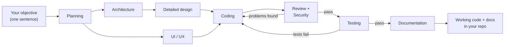

# Orca SDLC Flow Kit

**Describe a feature in one sentence. Get back a planned, designed, coded, reviewed, tested and documented implementation.**

## Contents

- [Why this kit](#why-this-kit)
- [How it works](#how-it-works)
- [Quick start](#quick-start)
  - [1. Set up your project](#1-set-up-your-project)
  - [2. Configure your pipeline](#2-configure-your-pipeline)
  - [3. Change the harness](#3-change-the-harness)
- [Cheat sheet](#cheat-sheet)
- [The pipelines](#the-pipelines)
- [Watch it run — the live status page](#watch-it-run--the-live-status-page)
- [When something goes wrong](#when-something-goes-wrong)
- [Contributing](#contributing)
- [Roadmap](#roadmap)
- [License](#license)

## Why this kit

Driving AI coding agents by hand does not survive a real feature:

- **You become the pipeline.** Copy the plan to the coder, paste the code to a reviewer, carry the feedback back — babysitting terminals, one prompt at a time, for every step of every task.
- **Context drifts.** Each fresh chat forgets what the previous one decided. You re-explain the design every time, or the agent re-breaks what review just fixed.
- **Quality is whatever the agent says it is.** Nothing forces a review, a security pass or tests to actually happen — and nothing sends the coder back when they fail.
- **One harness carries everything.** Plan, code and docs in a single context window: one bad answer mid-project poisons everything downstream, and switching tools means rebuilding your whole workflow.
- **A long run is a black box.** Is that 40-minute coding step working or hung? If your session dies at step 7 of 9, you start over from zero.

With **[Orca ADE](https://www.onorca.dev/)** providing the runtime — disposable worktrees, agent terminals, run and task tracking — this kit turns that into an assembly line: a small "software team" of agents (planner, architect, coder, reviewers, tester, writer). Each does one job, writes its result to disk as readable Markdown, and hands it to the next; quality failures loop back automatically, independent steps run in parallel, a live dashboard shows every move, and an interrupted run resumes where it stopped. Cross-platform (Windows / macOS / Linux), one folder, needs only Node.

Two ideas drive the whole kit:

- **It works like a real SDLC.** Not one agent improvising everything: a sequence of specialists with quality gates between them — review, security and test failures loop back to the coder automatically, so the pipeline doesn't just generate code, it defends its quality. Independent steps even run at the same time: the two design passes work in parallel.
- **The harness is yours to swap.** Each step runs on whichever AI you pick — claude, codex, opencode, gemini, cursor, grok or kiro-cli — mixed freely across the pipeline. Enable, reorder or reassign a step in one JSON config; no code edits, ever.

## How it works

```bash
node .orca/flow.mjs "Build a login page with email + Google sign-in"
```

Specialist agents take over, each doing one job and handing its work to the next:



The two design steps (`Detailed design` and `UI / UX`) start together and run **concurrently** — one `parallelWith` line in the config; Coding waits for both. Any independent pair of steps can do this.

Three things make this safe rather than a black box:

- **Everything is left on disk.** Each step writes a readable Markdown artifact (`PLAN.md`, `ARCHITECTURE.md`, `CHANGES.md`, ...) into `.orca/artifacts/` — check, edit or reuse any intermediate result.
- **Quality failures loop back.** If review, security review or tests find problems, the coder is sent back to fix them — automatically, up to a bounded number of retries.
- **Token usage per run.** After each run ends (success or failure), token consumption per step (input / output / cache) is read from the Claude Code and Codex session logs, appended to `.orca/artifacts/USAGE.md` in the worktree, and shown on the status page (per-step chips, run total, and a breakdown on the finished-run summary). Fully automatic and display-only; agents without an adapter (opencode, gemini, cursor, grok, kiro-cli) show "—". Token numbers are post-hoc: they appear on the page when the run ends, not while it runs.

## Quick start

### 1. Set up your project

**Prerequisites — Orca comes first.** This kit has no runtime of its own: it drives agents inside **Orca ADE** terminals and worktrees, so nothing runs without it. Before starting, make sure you have:

- **[Orca ADE](https://www.onorca.dev/) installed and signed in** — the kit spawns agent terminals, worktrees and Runs through it; no Orca, no run.
- **Node.js** (any recent version) — the orchestrator is one Node script, zero npm dependencies.
- **The agent CLIs you plan to use** — e.g. `claude`, `codex`, `opencode` — installed and logged in; Orca launches whatever the config names.

1. Copy `orca.yaml` and the `.orca/` folder into your project root.
2. Add `.orca/artifacts/` to your `.gitignore`.
3. In Orca: Settings -> Experimental -> enable **Orchestration** (verify with `orca status --json`).
4. Create a worktree in Orca — the hook prepares `.orca/artifacts` for you.
5. Preview, then run:

```bash
node .orca/flow.mjs --dry-run "Build a login page"   # shows the plan, calls nothing
node .orca/flow.mjs "Build a login page"             # the real run
```

Optional Orca button — Settings -> Quick Commands (scope **Project**): `Run SDLC flow` -> `node .orca/flow.mjs "Objective"`.

### 2. Configure your pipeline

Everything lives in `.orca/flow.config.json` — no code edits, ever. The kit is stack-agnostic; to force a specific tool, name it in a step's `spec` (e.g. "run tests with pytest").

| I want to... | Do this |
|---|---|
| Skip a step (e.g. no UI/UX) | set `"enabled": false` on that step — later steps adjust automatically |
| Change what a step does | edit its `"spec"` text; `{out}` / `{reads}` / `{tasks}` are filled in for you |
| Add my own step (e.g. a lint gate) | add an entry to the `"pipeline"` array — order in the array is the run order |
| Retry harder on failures | raise `"maxRetries"` (how often review/test failures loop back to coding) |
| Give a step more time | raise its `"timeoutMs"` (max silence) / `"hardTimeoutMs"` (absolute cap) |
| Run two steps at the same time | set `"parallelWith": "<earlier-step-id>"` on the later step — both start together; the next step waits for both |
| Run just part of the pipeline | `--only planning,architecture "..."` |
| Continue after a crash or a long step | re-run with `--from coding` — earlier artifacts are reused |

Two knobs cover the rest:

- **`autoRun` (default `true`) — how much it asks you.** `true`: start it and walk away — agents never ask, they decide and record assumptions in the artifact for you to audit later; gates are ignored, and Claude Code agents run with permission bypass (full tool access; one-time per-machine acceptance on first use) so nothing waits for a click. `false` (manual mode): agents may ask in their terminal; steps with `"gate": true` pause for your approval, and steps with `"interactive": true` (the shipped Architecture step) interview you — one question at a time, confirming every decision before writing.
- **The worktree (default: auto-detected) — where it runs.** Agents run in the Orca worktree of the folder you launch from. Pin only when launching from outside the target: `--worktree name:lab2` for one run, `ORCA_FLOW_WORKTREE` for your machine. A wrong pin fails immediately with the list of valid worktrees — never mid-run.

### 3. Change the harness

Any step, any agent — it is one field in the step's config entry:

```json
{
  "id": "coding",
  "title": "Coding",
  "agent": "codex",
  "spec": "..."
}
```

- **Supported agents:** `claude`, `codex`, `opencode`, `gemini`, `cursor`, `grok`, `kiro-cli`. The shipped config already mixes them — coding on codex, testing on opencode, the rest on claude.
- **For one run only:** `node .orca/flow.mjs --agent coding=claude "Objective"` — the config stays untouched.
- **Agent flags work too:** a value like `"claude --model x"` keeps your flags, and multi-word values like `"kiro-cli --trust-all-tools"` are passed through as-is.

Full field reference (timeouts, models, custom steps, the fix loop): [`.orca/CONFIGURATION.md`](.orca/CONFIGURATION.md).

## Cheat sheet

```bash
node .orca/flow.mjs "Objective"                     # the whole pipeline
node .orca/flow.mjs --dry-run "Objective"           # preview only — always try this first
node .orca/flow.mjs --status-preview                # sample dashboard only — never with an objective
node .orca/flow.mjs --from coding "Objective"       # resume / skip the design phase
node .orca/flow.mjs --only planning,architecture "Objective"
node .orca/flow.mjs --grill-me "Objective"          # interview me before planning
node .orca/flow.mjs --agent coding=claude "Objective"   # one-off agent swap for a step
node .orca/flow.mjs --config fixbug.config.json "Bug report"
node .orca/flow.mjs --worktree name:lab "Objective" # only when launching from outside the target
```

Manual mode (approval gates + interviews): set `"autoRun": false` in `.orca/flow.config.json`, then run normally.

## The pipelines

**Full SDLC (`flow.config.json`) — the default:**

| # | Step | Agent | Writes | On fail |
|---|------|-------|--------|---------|
| 0* | Grill Me (requirements interview, opt-in) | claude | BRAINSTORM.md | — |
| 1 | Planning | claude | PLAN.md | — |
| 2 | Architecture Design † | claude | ARCHITECTURE.md | — |
| 3 | Detailed Design | claude | DETAILED_DESIGN.md | — |
| 4 | UI/UX Design | claude | UIUX_MOCKS.md | — |
| 5 | Coding | codex | CHANGES.md | — |
| 6 | Code Review | claude | REVIEW.md | back to 5 |
| 7 | Security Review | claude | SECURITY_REVIEW.md | back to 5 |
| 8 | Testing | opencode | TEST_REPORT.md | back to 5 |
| 9 | Documentation | claude | DOCUMENTATION.md | — |

\* Disabled by default; enable per run with `--grill-me` or permanently in config.
† In manual mode this step interviews you first (see `autoRun` above).

Beside the steps' own artifacts, the flow writes one file of its own into the same dir: `USAGE.md`, the cumulative per-run token report — one section per run, appended automatically when the run ends (reserved name: don't use it as a step `writes` value).

Steps 3 and 4 run **concurrently** (`parallelWith`) — both read Architecture, and Coding waits for both.

**Bug fix (`fixbug.config.json`):** Root Cause Analysis -> Fix Plan -> Bug Fix incl. regression test -> Fix Verification, looping back on failure (max 2 retries).

```bash
node .orca/flow.mjs --config fixbug.config.json "<what happens, expected behavior, how to reproduce>"
```

## Watch it run — the live status page

Start a run and a dashboard opens itself in your browser —
`<worktree>/.orca/artifacts/status.html` — and keeps updating on its own while
the agents work: which step is running, what is done, what comes next, timings,
retry attempts and the final artifact list. No refresh button, no server.


The star of the mid-run view is that **Tasks card**: steps with a task
checklist (`progress` in config — the coding step has one) show every
implementation task as `○` queued, `◐` in progress or `✓` done
(`.orca/artifacts/TASKS.md`), ticked off live by the coding agent — so you
always know what is done and what is left without opening a single file.

After a run ends, the page also shows its token usage: a compact total per
step in the rail, the run total in the header, and a per-step in / out /
cache-read / cache-write breakdown on the summary card. Steps without numbers
show nothing — `USAGE.md` in the artifacts dir is the detailed record.

A run resumed with `--from` continues the same picture, earlier steps keeping
their original durations. If the page can't be written the run continues
untouched — the dashboard never affects the pipeline. Peek without a run:
`node .orca/flow.mjs --status-preview` (never combined with an objective or
`--only`/`--from`/`--agent`). Disable auto-open with `--no-open-status` or
`"defaults": { "openStatus": false }`.

## When something goes wrong

- **Preview first** — `--dry-run` shows exactly what will run; make it a habit.
- **A claude agent's terminal shows a one-time "accept responsibility" dialog** — Claude Code asks this once per machine the first time a session starts with permission bypass. Accept it once (it is remembered), or pre-set `"skipDangerousModePermissionPrompt": true` in your user-level Claude Code settings. Bypass grants the agent full tool access — which is why unattended pipelines belong in disposable Orca worktrees (the default way this kit runs).
- **A step looks quiet for a long time** — silence is not treated as failure: an agent deep in one long verification (reviews routinely run an hour) is waited on until it settles or its hard cap hits. The fix loop only triggers on a definite FAIL verdict, never on a silent worker.
- **A step is taking forever** — the status page shows it as STILL RUNNING; the flow leaves that agent's terminal open and prints the exact `--from <step>` command to continue later.
- **Stale orchestration state after experiments** — `orca orchestration reset --all --json`.
- **CLI flags differ on your Orca version** — check `orca skills get orchestration --full`.
- **Claude agent crashes with `EBADF ... history.jsonl.lock` (Windows)** — known Claude Code bug ([#15739](https://github.com/anthropics/claude-code/issues/15739)); the flow already spawns Claude agents in a way that avoids it. If it still happens, close other Claude Code sessions during interactive steps, or update Claude Code.

## Contributing

Issues and pull requests are welcome at [github.com/vankhangfet/orca-sdlc-kit](https://github.com/vankhangfet/orca-sdlc-kit). A few ground rules keep the kit what it is:

- **Pipeline behavior belongs in the configs.** New behavior means a new field in `flow.config.json` / `fixbug.config.json` plus a paragraph in [`.orca/CONFIGURATION.md`](.orca/CONFIGURATION.md) — not new logic in `flow.mjs`.
- **Docs ship with the change.** Update `README.md` and `.orca/CONFIGURATION.md` in the same PR as any behavior change.
- **Conventional commits** (`feat:`, `fix:`, `docs:`, ...). Never commit `docs/` (internal notes) or `.orca/artifacts/` (runtime output) — both are gitignored.
- **Verify before you push.** There is no build or test toolchain; the loop is:

```bash
node --check .orca/flow.mjs                                                        # syntax
node -e "JSON.parse(require('fs').readFileSync('.orca/flow.config.json','utf8'))"   # config validity
node .orca/flow.mjs --dry-run --worktree name:lab2 "objective"                     # plan preview (this repo is not a worktree)
```

Looking for something to pick up? [ROADMAP.md](ROADMAP.md) lists what's planned — and, just as important, what will *not* be built.

## Roadmap

Next up: config validation before any agent starts, an artifact viewer and run history on the status page, auto-resume, notifications and batch runs — see [ROADMAP.md](ROADMAP.md).

## License

[MIT](LICENSE)
