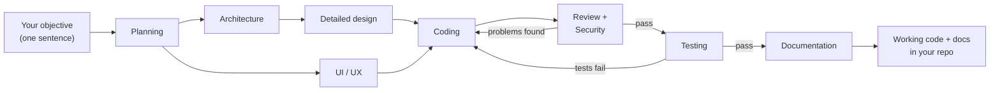

# Orca SDLC Flow Kit

**Describe a feature in one sentence. Get back a planned, designed, coded, reviewed, tested and documented implementation.**

The kit assembles a small "software team" of AI agents inside Orca ADE — a planner, an architect, a coder, reviewers, a tester and a writer. You give the objective; they run the relay. Every step can be switched on or off, re-ordered, or assigned to a different AI in one config file. Cross-platform (Windows / macOS / Linux), needs only Node.

---

## The idea in 30 seconds

You run one command with a plain-language objective:

```
node .orca/flow.mjs "Build a login page with email + Google sign-in"
```

From there, specialist agents take over, each doing one job and handing its work to the next:



Two things make this safe rather than a black box:

- **Everything is left on disk.** Each step writes a readable Markdown file (`PLAN.md`, `ARCHITECTURE.md`, `CHANGES.md`, ...) into `.orca/artifacts/`. Check, edit or reuse any intermediate result.
- **Quality failures loop back.** If the code review, security review or tests find problems, the coder is sent back to fix them — automatically, up to a bounded number of retries.

## Two knobs control everything

**Knob 1 — how much it asks you: `autoRun` (default: fully automatic)**

| | `"autoRun": true` (default) | `"autoRun": false` |
|---|---|---|
| In plain words | Start it and walk away | It consults you at key points |
| Questions | Agents never ask — they decide and write their assumptions in the artifact for you to audit later | Agents may ask in their terminal |
| Architecture Design | Runs by itself | **Interviews you first** — one question at a time about requirements, performance, security, scalability, database, etc., and confirms every decision with you before designing |
| Steps marked `"gate": true` | Ignored | Pause the pipeline until you approve (the flow prints the exact approve command) |
| Typical use | Overnight and batch runs | High-stakes work that needs your sign-off |

Switching is one line in `flow.config.json`. Full explanation in [Automation modes](#automation-modes--autorun) below.

**Knob 2 — where it runs: the worktree (default: auto-detected)**

Agents run in the Orca worktree of the folder you launch from — nothing to configure in the normal case. Only when you launch from *outside* the target do you say where to run: `--worktree name:lab2` for one run, or the `ORCA_FLOW_WORKTREE` environment variable for your machine. A wrong pin fails immediately with the list of valid worktrees — never mid-run.

## Quick start

1. Copy `orca.yaml` and the `.orca/` folder into your project root.
2. Add `.orca/artifacts/` to your `.gitignore`.
3. In Orca: Settings -> Experimental -> enable **Orchestration** (verify with `orca status --json`).
4. Create a worktree in Orca — the hook prepares `.orca/artifacts` for you.
5. Preview, then run:

```
node .orca/flow.mjs --dry-run "Build a login page"   # shows the plan, calls nothing
node .orca/flow.mjs "Build a login page"             # the real run
```

Optional Orca button — Settings -> Quick Commands (scope **Project**): `Run SDLC flow` -> `node .orca/flow.mjs "Objective"`.

## Watch it run — the live status page

While the pipeline runs, the flow writes a live dashboard into the worktree: open
`<worktree>/.orca/artifacts/status.html` in a browser (it opens by itself when
the run starts) and it updates on its own — which step is running,
what is done, what comes next, timings, retry attempts, and the final artifact
list. An interrupted run resumed with `--from` continues the same picture.
Disable the auto-open with `--no-open-status` or `"defaults": { "openStatus": false }`.

## "I want to..." — the configuration cookbook

Everything lives in `.orca/flow.config.json` (no code edits ever):

| I want to... | Do this |
|---|---|
| Skip a step (e.g. no UI/UX) | set `"enabled": false` on that step — later steps adjust automatically |
| Use a different AI for a step | edit `"agent"` — claude, codex, opencode, gemini, cursor, grok, kiro-cli |
| Change what a step does | edit its `"spec"` text; `{out}` / `{reads}` are filled in for you |
| Be interviewed on architecture | keep `"interactive": true` on Architecture and set `"autoRun": false` |
| Add my own step (e.g. a lint gate) | add an entry to the `"pipeline"` array — order in the array is the run order |
| Pause for my approval after a step | set `"gate": true` on it (works in manual mode) |
| Retry harder on failures | raise `"maxRetries"` (how often review/test failures loop back to coding) |
| Continue after a crash or a long step | re-run with `--from coding` — earlier artifacts are reused |
| Run just part of the pipeline | `--only planning,architecture "..."` |
| Fix a bug instead of building a feature | use the second pipeline: `--config fixbug.config.json "<bug + reproduction steps>"` |

Field-by-field reference: [`.orca/CONFIGURATION.md`](.orca/CONFIGURATION.md).

## Automation modes — `autoRun`

One top-level switch controls how much the pipeline involves you:

```jsonc
"autoRun": true   // default — set to false for manual mode
```

**Auto-run (default).** Every step's spec carries an autonomy directive: *do not ask the user, do not wait for confirmation — decide with best judgment and record every decision under an "Assumptions & decisions" section in the artifact.* You audit afterwards instead of babysitting. Gates are ignored, so nothing ever blocks on a human.

**Manual mode.** Agents may ask in their terminal. Two per-step opt-ins become active (both ignored in auto-run):

- **`"interactive": true` — structured interview.** The agent asks one question at a time (mostly multiple choice), restates each answer so you can correct it early, then confirms a numbered DECISIONS list before writing its artifact. The shipped config marks **Architecture Design** this way: the interview covers functional & non-functional requirements, performance targets and expected load, security & compliance, scalability, database/persistence, technology constraints, and deployment. Timeouts are raised automatically (60 min silence / 4 h hard) because the terminal idles while waiting for your answers. Add `"interactive": true` to any other step for the same behavior.
- **`"gate": true` — approval gate.** After the step finishes, the flow prints a `gate-resolve` command and waits (up to `defaults.gateTimeoutMs`, 60 min by default) for your approval before continuing.

The only exception in both modes is the opt-in **Grill Me** step (`--grill-me`): an up-front requirements interview that is interactive by design.

## The pipelines, in detail

### Full SDLC (`flow.config.json`)

| # | Step | Agent | Writes | On fail |
|---|------|-------|--------|---------|
| 0* | Grill Me (requirements interview, opt-in) | claude | BRAINSTORM.md | — |
| 1 | Planning | claude | PLAN.md | — |
| 2 | Architecture Design † | claude | ARCHITECTURE.md | — |
| 3 | Detailed Design | claude | DETAILED_DESIGN.md | — |
| 4 | UI/UX Design | claude | UIUX_MOCKS.md | — |
| 5 | Coding | codex | CHANGES.md | — |
| 6 | Code Review | claude | REVIEW.md | back to 5 |
| 7 | Security Review | claude | SECURITY_REVIEW.md | back to 5 |
| 8 | Testing | opencode | TEST_REPORT.md | back to 5 |
| 9 | Documentation | claude | DOCUMENTATION.md | — |

\* Disabled by default; enable per run with `--grill-me` or permanently in config.
† In manual mode this step interviews you first (see above).

Specs are deliberately **stack-agnostic** — no language or framework is assumed, so the kit works on any project. To force a specific tool, name it in the step's `spec` (e.g. "run tests with pytest").

### Bug fix (`fixbug.config.json`)

For reported bugs: Root Cause Analysis -> Fix Plan -> Bug Fix (code + regression test) -> Fix Verification, looping back on failure (max 2 retries).

```
node .orca/flow.mjs --config fixbug.config.json "<what happens, expected behavior, how to reproduce>"
```

## Cheat sheet

```bash
node .orca/flow.mjs "Objective"                     # the whole pipeline
node .orca/flow.mjs --dry-run "Objective"           # preview only — always try this first
node .orca/flow.mjs --from coding "Objective"       # resume / skip the design phase
node .orca/flow.mjs --only planning,architecture "Objective"
node .orca/flow.mjs --grill-me "Objective"          # interview me before planning
node .orca/flow.mjs --agent coding=claude "Objective"
node .orca/flow.mjs --config fixbug.config.json "Bug report"
node .orca/flow.mjs --worktree name:lab "Objective" # only when launching from outside the target
```

Manual mode (approval gates + interviews): set `"autoRun": false` in `.orca/flow.config.json`, then run normally.

## When something goes wrong

- **Preview first** — `--dry-run` shows exactly what will run; make it a habit.
- **A step looks quiet for a long time** — silence is not treated as failure: an agent deep in one long verification (reviews routinely run an hour) is waited on until it settles or the step's hard cap (default 4x its timeout) is hit. The fix loop only ever triggers on a definite FAIL verdict, never on a silent worker.
- **A step is taking forever** — the flow leaves that agent's terminal open and prints the exact `--from <step>` command to continue later.
- **Stale orchestration state after experiments** — `orca orchestration reset --all --json`.
- **CLI flags differ on your Orca version** — check `orca skills get orchestration --full`.
- **Claude agent crashes with `EBADF ... history.jsonl.lock` (Windows)** — known Claude Code bug ([#15739](https://github.com/anthropics/claude-code/issues/15739)); the flow already spawns Claude agents in a way that avoids it (`CLAUDE_CODE_SKIP_PROMPT_HISTORY=true`). If it still happens, close other Claude Code sessions during interactive steps, or update Claude Code.

## License

[MIT](LICENSE)
