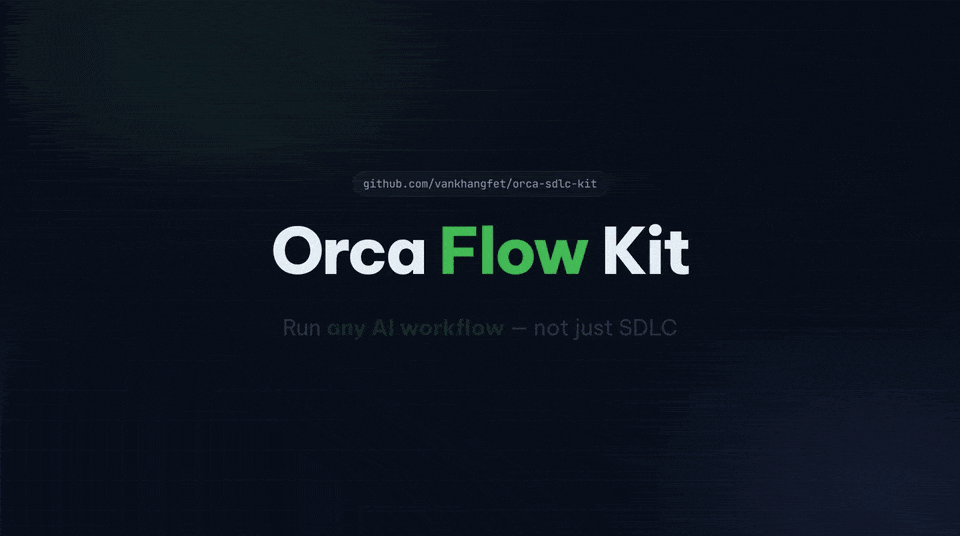
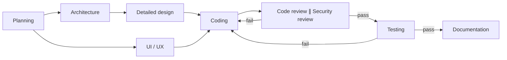
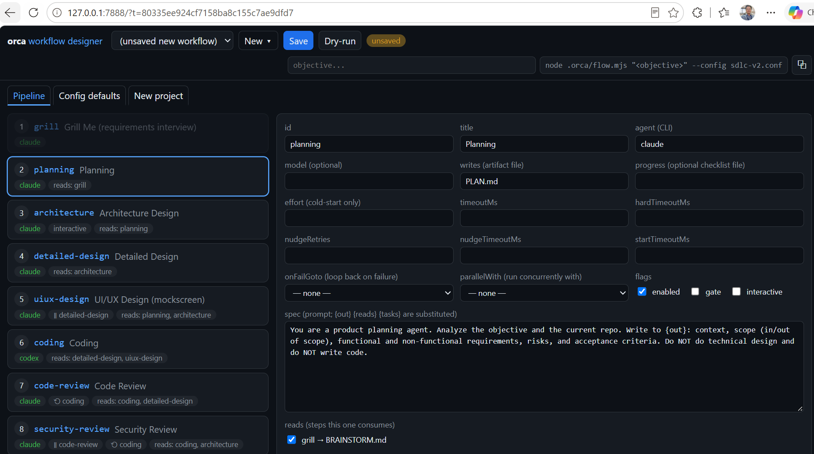
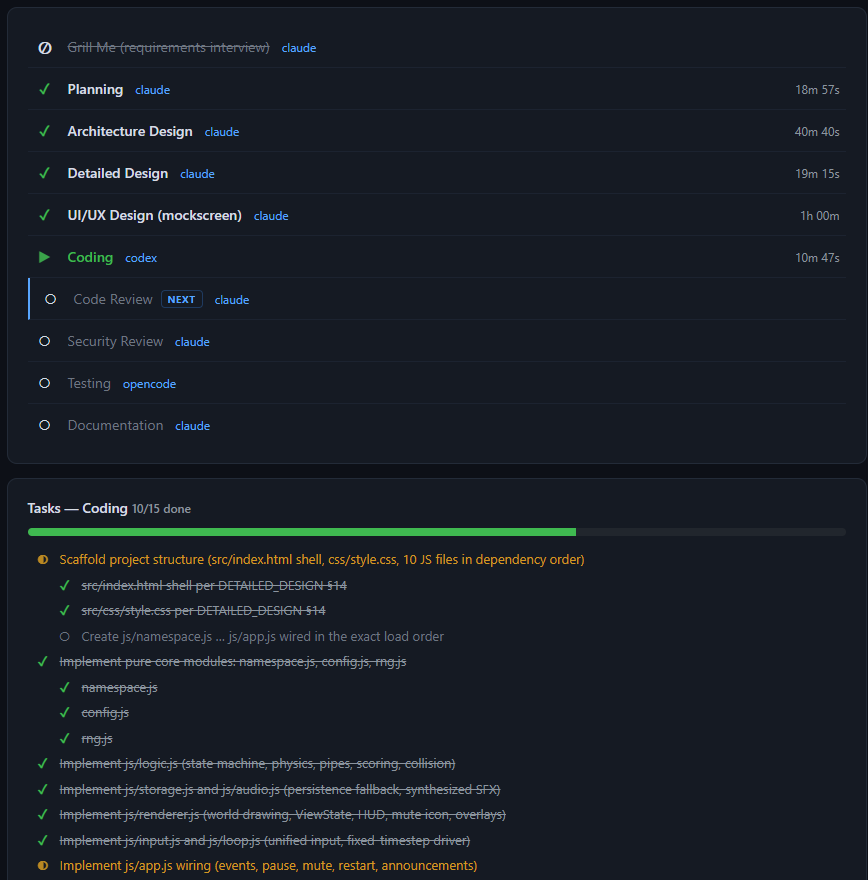

# Orca Flow Kit — Any AI Workflow, Not Just SDLC

<a href="https://deepwiki.com/vankhangfet/orca-sdlc-kit"></a>
<a href="https://github.com/vankhangfet/orca-sdlc-kit"></a>
<a href="LICENSE"></a>
<a href="https://github.com/vankhangfet/orca-sdlc-kit/tags"></a>
<a href="https://x.com/vankhangfet"></a>

**Describe a multi-step job once, in one JSON file. Specialist AI agents each do one step, write the result to disk, and hand it to the next. You can watch the run live, failures loop back automatically, and every verdict can go to your team's chat. No code needed.**



## Why

Driving AI agents by hand doesn't hold up on real work. Prompts get passed between terminals, a new chat forgets earlier decisions, and nothing forces a review or a test to happen.

This kit runs on **[Orca ADE](https://www.onorca.dev/)** and turns any multi-step job into an assembly line:

| | |
|---|---|
| **Workflow as config** | Steps, agents, models, retries and parallel groups all live in one JSON file. |
| **Bring your own agents** | Use the CLI agents you already have (`claude`, `codex`, `opencode`, `gemini`, `cursor`, `grok`, `kiro-cli`, …), mixed freely, one per step. |
| **Results on disk** | Every step writes a Markdown artifact (`PLAN.md`, `CHANGES.md`, …) that you can inspect, edit or reuse. |
| **Quality gates** | A failed review, security check or test sends the work back to coding, up to a set number of retries. |
| **Live and reported** | A status page that updates itself, per-step token usage, and chat notifications. |

## Quick start

**Prerequisites:** [Orca ADE](https://www.onorca.dev/) installed and signed in, Node.js (any recent version), and the agent CLIs you plan to use, logged in.

```bash
npx github:vankhangfet/orca-sdlc-kit      # copy the kit into your project
```

1. In Orca, go to **Settings → Experimental** and enable **Orchestration**.
2. Create a worktree in Orca.
3. Preview the run, then start it:

```bash
node .orca/flow.mjs --dry-run "Build a login page"   # shows the plan, calls nothing
node .orca/flow.mjs "Build a login page"             # the real run
```

## How it works



- Each step is one agent with one job. It reads the artifacts from earlier steps and writes its own to `.orca/artifacts/`.
- Steps marked `∥` run in parallel. The next step waits for both of them.
- Each new run saves the previous run to `.orca/artifacts/runs/`. At startup you can resume an earlier run from where it stopped.

## Three workflows ship ready to run

| Config | Use it for | Pipeline |
|---|---|---|
| `flow.config.json` *(default)* | New features, full SDLC | planning → architecture → design ∥ UI/UX → coding → review ∥ security → testing → docs |
| `fixbug.config.json` | Bug fixes | root cause → fix plan → fix + regression test → verification |
| `cr.config.json` | Changes to an existing system | impact analysis → CR plan → coding → review → testing → acceptance |

```bash
node .orca/flow.mjs --config fixbug.config.json "<what happens, expected behavior, how to reproduce>"
```

`.orca/workflow-template/` has variants of all three that finish with **Rebase & Push**. These configs are starting points. Any job you can describe as a series of steps runs the same way, for example a migration plan or a draft → review → polish loop for content.

## Configure — plain JSON, zero code

Everything is in `.orca/flow.config.json`. Array order is run order.

```json
{
  "id": "security-review",
  "title": "Security Review",
  "agent": "claude",
  "model": "default",
  "writes": "SECURITY_REVIEW.md",
  "reads": ["coding"],
  "parallelWith": "code-review",
  "onFailGoto": "coding",
  "spec": "Review the changes for security issues. Write findings to {out}."
}
```

| I want to… | Do this |
|---|---|
| Skip a step | `"enabled": false` |
| Add a step | Add an entry to `"pipeline"` |
| Swap the agent or model | `"agent"` / `"model"` on the step, or `--agent coding=claude` for a single run |
| Run two steps together | `"parallelWith": "<earlier-step-id>"` |
| Loop back on failure | `"onFailGoto"` plus `"maxRetries"` (global or per step) |
| Be asked questions / approve gates | `"autoRun": false` (manual mode) |

Full field reference: [`.orca/CONFIGURATION.md`](.orca/CONFIGURATION.md).

**Prefer clicking?** `node .orca/designer.mjs` opens the **Workflow Designer**, a local, token-guarded web UI. You can drag steps to reorder them, edit each step in a form, validate, dry-run, and create new workflows or projects.



## Watch it run

When a run starts, `.orca/artifacts/status.html` opens in your browser and keeps itself up to date. It shows which steps are running, done or next, along with timers, retries, a live task checklist, artifacts and token usage per step. There is no server and nothing to refresh.



**Chat notifications:** fill in [`.orca/notify.json`](.orca/notify.json) and each step's verdict, plus a run summary with a safe resume command, goes to **Slack, Telegram, MS Teams, WhatsApp** or any JSON webhook. Notifications are off by default and are timeout-guarded, so a dead webhook never stalls the run.

## Cheat sheet

```bash
node .orca/flow.mjs "Objective"                          # full pipeline
node .orca/flow.mjs --dry-run "Objective"                # preview only
node .orca/flow.mjs --from coding "Objective"            # resume from a step
node .orca/flow.mjs --only planning,architecture "..."   # run part of the pipeline
node .orca/flow.mjs --grill-me "Objective"               # requirements interview first
node .orca/flow.mjs --agent coding=claude "Objective"    # one-off agent swap
node .orca/designer.mjs                                  # Workflow Designer
```

## How it compares

| | **This kit** | LangGraph / CrewAI / OpenAI Agents SDK | n8n |
|---|---|---|---|
| Layer | Workflow layer **above** existing coding agents | Frameworks for **building** agents | General automation |
| Defined in | JSON, no code | Python | Visual UI |
| Agents | CLI agents you already use | Ones you build | Tool nodes |

These tools sit at different layers, so they don't really compete.

## Troubleshooting

- Always start with `--dry-run`.
- If a step times out, re-run with the printed `--from <step>` command.
- If an agent is parked on a prompt, answer it in that agent's terminal and the run continues.
- If a long, quiet step looks stuck, the kit waits for it until its time cap. Only a definite FAIL loops back.

More fixes: [TROUBLESHOOTING.md](TROUBLESHOOTING.md).

## Contributing

Issues and PRs are welcome. Keep pipeline behavior in the configs, not in `flow.mjs`, and update the docs in the same PR. Use conventional commits and run `npm test` before you push. The test suite runs offline against a fake Orca CLI. See [ROADMAP.md](ROADMAP.md) for what's planned.

## License

[MIT](LICENSE)
